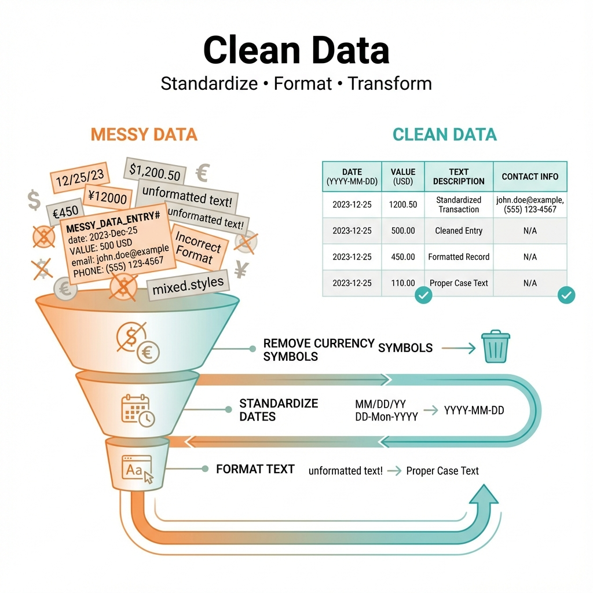
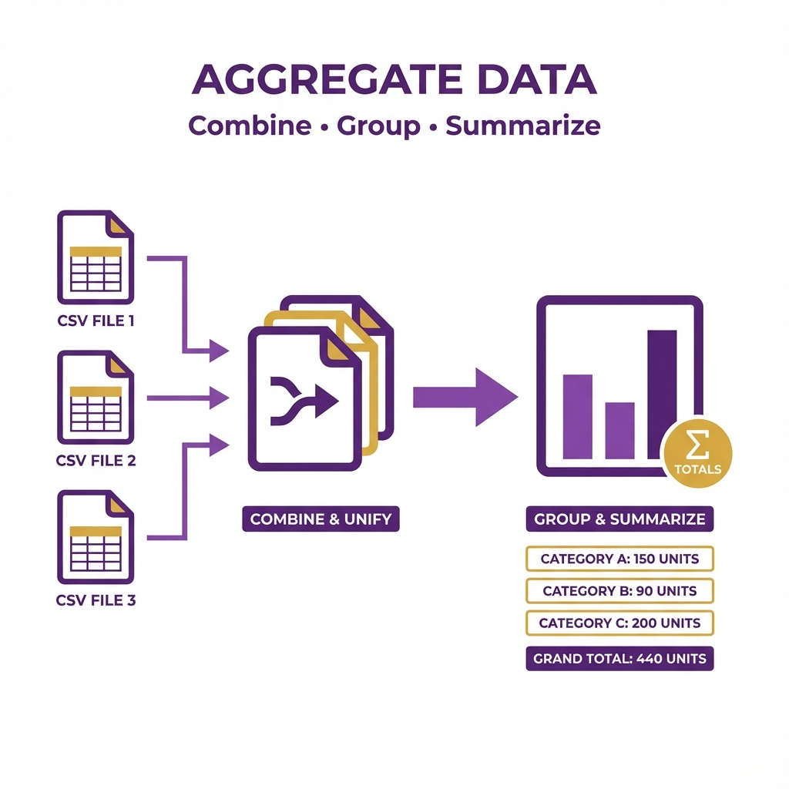
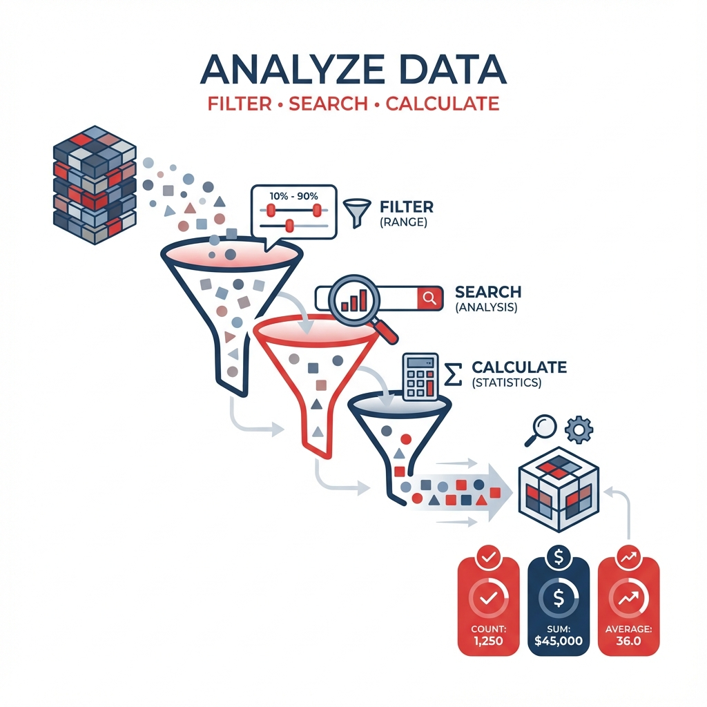

# Data Processing Toolkit - Overview

A desktop application for processing, cleaning, and analyzing CSV data files.

---

## What Is It?

The Data Processing Toolkit is a suite of 4 data tools built for accountants and data analysts who work with large CSV files. It runs locally on your computer using DuckDB for fast processing of files with 500K+ rows.

---

## The Tools

### 🔄 Reconcile Files
**Compare two data sources and find discrepancies.**

Match records between two CSV files based on a key field. Instantly identify:
- ✅ Exact matches
- ⚠️ Amount differences  
- ❌ Missing records

---

### 🧹 Clean Data
**Standardize messy data into consistent formats.**

Transform raw data exports into clean, usable files:
- Convert dates to a standard format
- Remove currency symbols from amounts
- Exclude unwanted columns

---

### 📊 Aggregate Data
**Combine multiple files and create summaries.**

Merge CSV files and calculate grouped totals:
- Combine files with matching columns
- Group by category, date, or any field
- Calculate totals and counts

---

### 🔍 Analyze Data
**Filter data and calculate statistics.**

Search and filter your data with multiple conditions:
- Filter by amount ranges
- Filter by date ranges
- Search text fields
- View statistics (sum, average, min, max)

---

## Quick Start

1. Run `python main.py` to launch the toolkit
2. Click a tool button on the home screen
3. Load your CSV file(s)
4. Configure settings and process
5. Export results to a new CSV

---

## Requirements

- Python 3.13+
- DuckDB
- Tkinter (included with Python)
